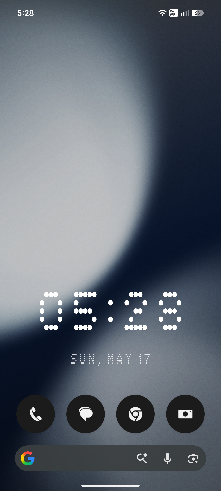
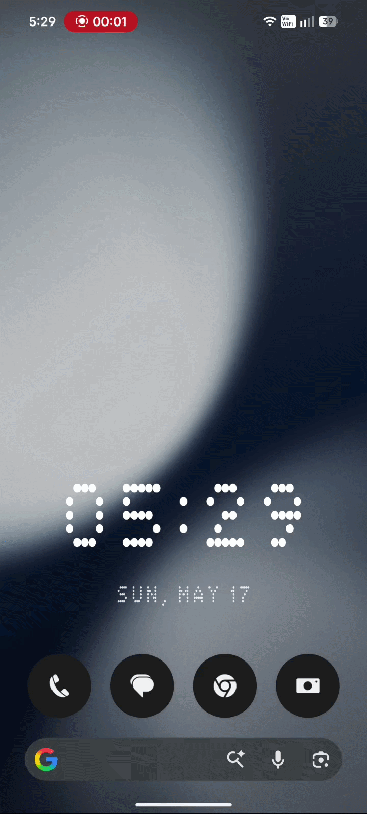

# 🕐 Nothing Phone — Transparent Dot Matrix Clock Widget

It is a custom dot matrix style clock widget for Nothing Phone with a fully transparent background. The default Nothing OS widget has a similar dot matrix style but its background is not transparent, this project fixes that and makes it blend perfectly into any wallpaper.

**Created by [Swapnil Majhi](https://github.com/Swapnil41)** learning UI/UX, assisted by Claude AI and Cursor AI.

---

## 📸 Preview

## 🎬 Demo

---

## ✨ Features

- 🔲 Dot matrix style clock display
- 🌫️ Fully transparent background — blends into any wallpaper
- ⏰ Tap the widget to open Google Clock instantly
- 🔄 Real-time updates (requires Alarms & Reminders permission)
- 📱 Designed specifically for Nothing Phone aesthetic
- 🏠 Does not clutter your app drawer — invisible in home screen app list

---

## 📲 Installation

1. Download the APK from the [Releases](../../releases) section
2. On your Nothing Phone, go to **Settings → Security** and enable **Install from unknown sources**
3. Open the downloaded APK and install it
4. The app will **NOT appear** in your home screen app list — this is normal
5. To access app info, go to **Settings → Apps → DotMatrixWidget**

---

## 🧩 Adding the Widget to Your Home Screen

1. Long press on your home screen
2. Tap **Widgets**
3. Find **DotMatrixWidget** in the list
4. Long press and drag it onto your home screen

---

## ⚙️ Important — Alarms & Reminders Permission

> Without this step the widget will only show a static time and will not update in real time.

1. Go to **Settings → Apps → DotMatrixWidget
2. Find **Alarms & Reminders** and toggle it **ON**
3. The widget will now update and show the correct live time

---

## 🔗 Tap Behavior

Tapping the widget opens **Google Clock** automatically (if installed on your device).

---

## 🛠️ Built With

- Android Studio
- Cursor AI (code modification and debugging)
- Claude AI (guidance and problem solving)
- Java / XML

---

## 💡 Why I Made This

Nothing Phone already has a beautiful dot matrix clock widget but its background is not transparent, which breaks the aesthetic on custom wallpapers. This project makes it truly blend into any home screen setup without any visual clutter.

---

## 🙋 About

Hi, I'm **Swapnil Majhi** — I am learning UI/UX design and this is 
my very first project. I identified a real design gap in an existing 
product and shipped a working solution on real hardware with zero 
prior coding experience.

Feel free to connect with me or follow my journey!

---

## 📄 License

This project is licensed under the MIT License — see the [LICENSE](LICENSE) file for details.
